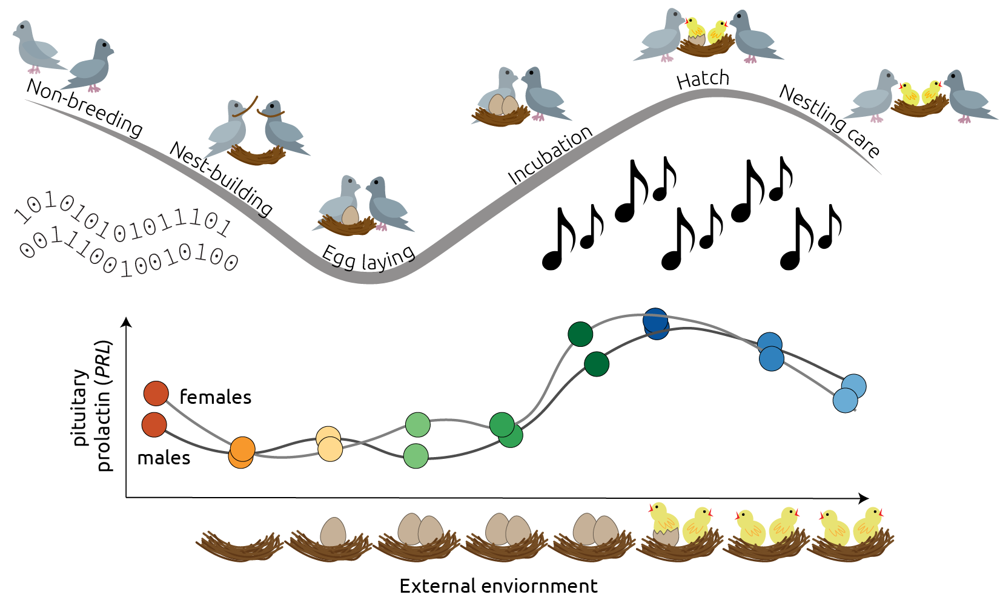

# Musical Genes

_A Shiny app for the vizualization and sonification of the gene expression during parental care._

Click the [Shiny link](https://raynamharris.shinyapps.io/musicalgenes/) for interactive data exploration on the web

If you want to examine the code or the raw datasets, click 

<!-- badges: start -->
  
  <!-- badges: end -->
  
## About

Genes work together in concert to regulate behavior. What does this 'transcriptional symphony' sound like? Data sonification is the presentation of data as sound. Musical Genes is a Shiny app that allows users to interactively visualize and sonify (or plot and play) gene expression to better understand the biology of parental care. The user can choose a gene from this pulldown menu and listen to how it changes over time. We also represent the levels of gene expression as notes on a scale that could be played on an instrument like a piano or guitar. Finally, we provide multiple visualizations that provide additional insight into genes that might work in concert to regulate parental care. Exploration of this data could provide additional insights of biological processes that of biomedical relevance all while making beautiful music.

## Shiny Contest

### Authors

Rayna Harris and Rebecca Calisi 

### Username(s)

@raynamharris

### Keywords

data science, reproducible research, animal behavior, neuroscience

### Category

Research

### URL of deployed app

<https://raynamharris.shinyapps.io/musicalgenes/>

### URL of source code

<https://github.com/raynamharris/musicalgenes>

### URL of RStudio Cloud project with app

<https://rstudio.cloud/project/1009357>

### Thumbnail Image Use dimensions 396x240.

### Screenshot of app (large)

### Short description

A Shiny app for the vizualization and sonification of the gene expression during parental care in pigeons.

### Longer description

Genes work together in concert to regulate behavior. What does this 'transcriptional symphony' sound like? Data sonification is the presentation of data as sound. Musical Genes is a Shiny app that allows users to interactively visualize and sonify (or plot and play) gene expression to better understand the biology of parental care. The user can choose a gene from this pulldown menu and listen to how it changes over time with the R packages `sonify` and `tuneR`. We also represent the levels of gene expression as notes on a scale that could be played on an instrument like a piano or guitar. Finally, we provide multiple visualizations that provide additional insight into genes that might work in concert to regulate biological processes of biomedical relevance.