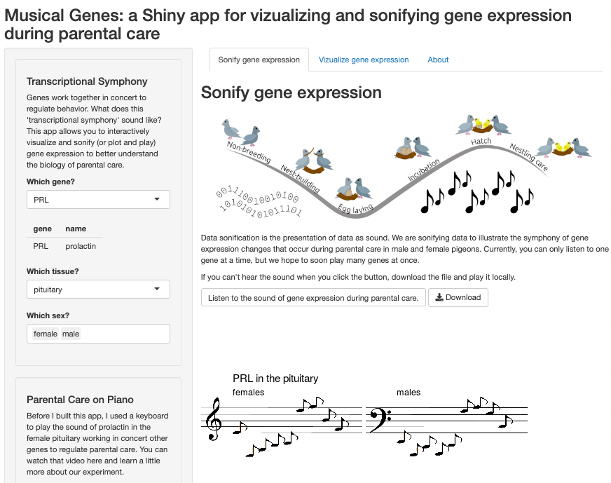

# Musical Genes: A Shiny app for the visualization and sonification of the gene expression during parental care

For interactive data exploration on the web, [click the Shiny link](https://raynamharris.shinyapps.io/musicalgenes/). To examine the code or the raw datasets, click the Binder button.

<!-- badges: start -->
  

  
  

  <!-- badges: end -->
  
Genes work together in concert to regulate behavior. What does this 'transcriptional symphony' sound like? Data sonification is the presentation of data as sound. Musical Genes is a Shiny app that allows users to interactively visualize and sonify (or plot and play) gene expression to better understand the biology of parental care. The user can choose a gene from this pulldown menu and listen to how it changes over time. We also represent the levels of gene expression as notes on a scale that could be played on an instrument like a piano or guitar. Finally, we provide multiple visualizations that provide additional insight into genes that might work in concert to regulate parental care. Exploration of this data could provide additional insights of biological processes that of biomedical relevance all while making beautiful music.

