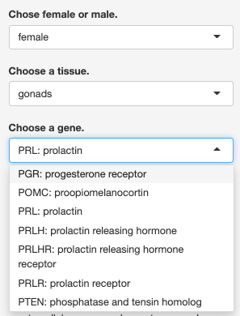
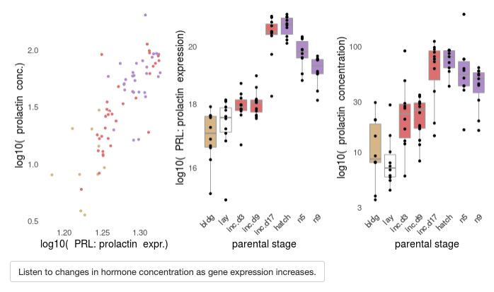

##  Summary

In addition to striving to conduct and publish reproducible research, scientists must also aim to create accessible research outputs. Readers with bioinformatics expertise can access the data and reproduce the results associated with published manuscripts; however, much of the data associated with publications is too large or to complex for the average reader to explore on their own. Furthermore, many of the visualize use to communicate transcriptomic findings are often inaccessible to those with poor color vision. We have create a application that provides a simple graphical user interface for interactive data explore and sonfiication to make transcriptomic data more accessible to diverse users. 

## Statement of need

Temporal and spatially controlled changes in gene expression are often described as a “symphony of gene expression”, with RNA polymerase function as the transcription factor that turns genes on in a coordinated fashion in response to external or internal cures. Could we gain more biological insight and make data more accessible if we utilized data sonification to actually listen to the metaphorical transitional symphony?   
  
Neuroscientists are known for listening to outputs while doing research, molecular biologists rarely use souned as a medium for data analysis or science communication. Sound has previously been used to evaluate the position of their electrodes inside cells and make inferences about the data (cite). Sonification is the use of non-speech audio to convey information or perceptualize data. Yet molecular biology continues to rely heavily on the presentation of data as technicolor images, often with complex images, illegible symbols and font, and color-blind insensitive palettes. Data sonification in transcriptomics represents a potential avenue for making transcriptomics research more accessible to broader audiences. Discuss electrophysiology in pop-culture.https://www.rollingstone.com/music/music-latin/residente-pecador-video-watch-905453/  
  
Because genes are highly conserved across species, the data from studies on model organisms are potentially useful to other scientists and clinicians. However, data accessibility is often a barrier to data reuse and thus the potential for biomedical discovery is diminished. Easy-to-use interfaces that allow users to interactively explore data in the cloud would speed discovery by eliminating the need to download data and install software as a precursor to data exploration. Sharing data and code alone, but using these notebook requires technical knowledge that many researchers and clinicians do not have. A challenge that researchers face is designing sequencing projects need to be large enough to have sufficient power to test hypotheses, and then making the data and results easily accessible to reduce barriers to translation research.   
  
## Aproach
  
We sought to create an open source tools for data exploration that could be used to reproducibly convert gene expression into sound. As a proto-type, we used data from Harris, Austin, et al 2020, a highly replicated experimental design to characterize the transcriptional activity of the hypothalamus, pituitary, and gonads axis at nine time points over the course of reproduction and parental care in male and female pairs as they transitioned from a sexually mature, non-reproductive state to a reproductive one. Nine pseudo-timepoints measured represent nest building, egg incubation, nesting care, and fledging (Fig 1).   

  
Gene expression data associated with Harris, Austin, et al 2020 (https://github.com/macmanes-lab/DoveParentsRNAseq) were imported into R for processing, analysis, and visualization (cite all the r packages).  Data were imported into R and stored in duckdb for faster access. Additional information about genes, such as their description, ontology, and associated diseases were obtained from the gene ontology database (Genome alliance). Gene names for the human ortholog were imported from the HUGO database (ref). 

Data were joined, filtered, selected, mutated, and plotted with various R packages (). We used R shiny to build a web application with the dual ability to reproduce a figure from the associated manuscript and sonify the data (https://raynamharris.shinyapps.io/musicalgenes/). The mean value of gene expression for each group and sonified those values using the R packages `sonify` and `tuneR` (ref). Additionally, the mean values were scaled from 0-6, rounded the data to an integer, and converted in letters from A to G so that the user can play a representation of the data on an instrument on their choosing, such as a piano. All the R code available under CC-BY at https://github.com/raynamharris/musicalgenes. 

Video tutorial describing how to use the Shiny app were created an made avilable on YouTube at <insert link>.  

Currently, the R shiny app is organized into 4 panels. The first panel is the heart and soul of the application. Here, you can vizualize and sonifiy gene expression ineractively for about 150 genes in the hypothalamus, pitutiary, and gonads of male and female rock doves to explore how variation in gene expression changes over he course of the natural parentla care cycles or in response to manipulations. As in Austin et al in prep, we show box-and-whisker plot median and range of gene expression at difference stages of reproduction, from building nests and incubating eggs to nurturing baby chicks. 

**Fig. 1 Musical Genes**

The default gene expression pattern shown by the shiny app is that of the prolactin gene (aslso refereed to as PRL) in the female pituitary. These results show that prolactin increases significantly between incubation day 9 and incubation day 17. 

Prolactin decrease significantly between non-reproductive control and nest building stages as well as between hatch and nestling care day 5. Prolactin decreases significantly when you remove offspring at incubation days 9, 17, and at hatch as well as when you extend the timing until hatch.  

**Fig. 2 Transcriptional cacophony?**

The second tab seeks to integrate physiology and gene expression by showing correlations between cirulating prolactin, sex steroids (estradiol and testosterone), corticosterone, and progesterone and the gene of interest. 

**Fig. 3 Hormonal symphony**

The third tab is about the future directions where we hope to tap the application to truly recreate the transcripotional and physiological symphony that regulates parental care. The final tab provides more information abdout the authors and the sources of funding for this project. 

**Fig. 4 Transcriptional Symphony**

## Significance 

This app allows for rapid data exploration associated with a research paper, which will allow peer-reviewers and readers without R expertise to explore the data.
  
We have created an Rstudio cloud enviornment that can sonify (turn into sound) the mean value of any given candidate gene and play it on the piano as a song as well as present resreent the data with statictics snd graphs as is typical of a scientific manuscript.   
  
By providing the combination of a statistical summary, a visual representation, and a musical resprenstation of the data, one can look for both broad and specific patterns in the data. For instance, the results above for prolactin illustrate beautifully how some genes increase their expression in preparation for a biological even then fall once that even has past or if its timing is altered. This makes sense given what we know about prolactin… Should I say something about how co-authors of this paper are biased towards prolactin?? Like think these results to what we have written about its role in reproduction and parental care before ( as in Oldfield, Harris, et al 2013; Austin and Word). Or say that Fararr et al in prep focuses solely on pituitary PRL in the hypothalamus and the gonas of male and females?   

or

By simultaneously viewing the data, reading the statistical summary, and listening the the changes in mean expression, the user gains a deeper understand at the complexity of the variation in the data. The farther away the notes are on the scale, the greater the difference in expression. Smale changes in expression, as indicated by adjunct notes (e.g.  F to G or E to D) are typically not significant, but large changes (e.g A to D or G to D) often represent significant increases or decreases in expression over time.  
  
By creating an interactively webapplication, we facilitate the generation and exploration of the data and results for dozens of genes of interest. The avilablility of this dataset will be of use to researchers trying to understand the role of candidate genes in regulating the fascinating biological transition into parenthood or the terrifying clinical transition into cancer. We turned gene expression data into music to make it posssible to listen to transcriptional changes that are of interest to scientists and clinicians.  
  
As stated in the introduction, we would like to bring to life the transcriptional symphony of parental care, but currently the tool Musical Genes only plays the sound of one gene at a time.   

In the future, we would like to play the sounds of many genes at once by a digital or live orchestra to listen to coordinated or discordiated changes in gene expression.   
  
One limiation of this application is that is is directly tied to this particular data. A future implementation of the tools could allow flexible data input. For instance, BioJupies is an online tool that rapidly creates interactive visualization of any RNA-seq data set in NCBI or a user uploaded data set (Torre et al). Our software applies to a single data set. The complexity of our experimental design with multiple variables and many combinations of comparison, scaling the data wrangling and visualization is not feasible. Regardless of size, future studies benefit from tools like BioJupies or Musical Genes or rapid data assessment. Despite these limitations, we still believe that this application presents a unique contribution to science by providing open access to software that makes data and results more accessible to diverse audiences.  

# References

Citations to entries in paper.bib should be in
[rMarkdown](http://rmarkdown.rstudio.com/authoring_bibliographies_and_citations.html)
format.

If you want to cite a software repository URL (e.g. something on GitHub without a preferred
citation) then you can do it with the example BibTeX entry below for @fidgit.

For a quick reference, the following citation commands can be used:
- `@author:2001`  ->  "Author et al. (2001)"
- `[@author:2001]` -> "(Author et al., 2001)"
- `[@author1:2001; @author2:2001]` -> "(Author1 et al., 2001; Author2 et al., 2002)"

# Acknowledgements

We acknowledge contributions from x and y.

# References
